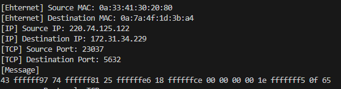

# PCAP-Programming

## 프로젝트 소개
리눅스에서 패킷을 캡쳐할 수 있는 라이브러리인 libpcap을 활용해,<br>
TCP 패킷을 캡쳐하고 MAC 주소, IP 주소, 포트 번호, 메시지를 출력합니다.


<br><br>
## 실행 방법
```
sudo apt-get install libpcap-dev
gcc -o sniff_improved sniff_improved.c -lpcap
sudo ./sniff_improved
```


<br><br>
## 실행 결과물



<br><br>
## 상세 설명
- myheader.h에 미리 정의되어 있는 ethheader, ipheader, tcpheader를 통해 실제 패킷의 각 프토토콜 헤더가 시작하는 지점의 포인터를 지정할 수 있습니다.
- 표기법에 맞추어 출력하기 위해 IP 주소는 inet_ntoa 함수를, MAC 주소는 직접 작성한 print_mac 함수를 사용해 출력했습니다. 
